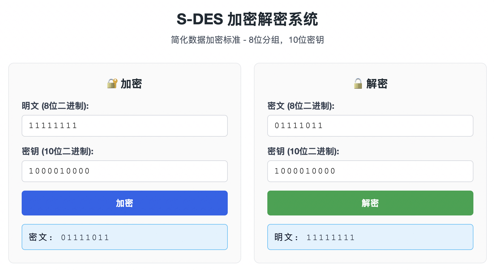
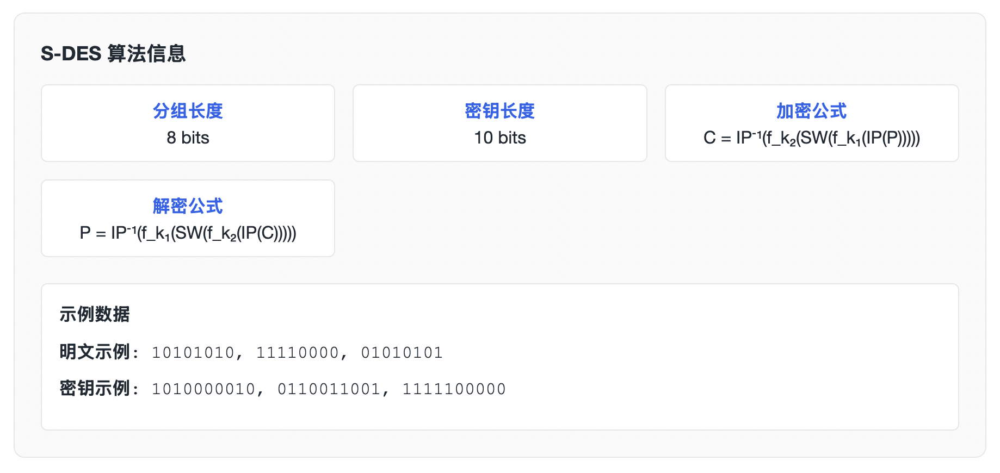

# S-DES 加解密 WEB-GO

## 项目简介
本实验使用 Go 语言配合 Gin 框架实现了简化数据加密标准（Simplified DES，简称 S-DES），并提供了一个直观的网页界面，方便对 8 位明文与 10 位密钥进行加密、解密实验。





## 快速开始

- **运行后端**：在项目根目录执行 `go run main.go`
- **访问前端**：浏览器打开 `http://localhost:8080`
- **API 接口**：
  - `POST /api/encrypt`：请求体 `{"plaintext":"8位二进制","key":"10位二进制"}`
  - `POST /api/decrypt`：请求体 `{"ciphertext":"8位二进制","key":"10位二进制"}`


## 前端功能
- 输入验证：限制只能输入指定位数的二进制字符。
- 一键互填：加密成功后自动将密文和密钥填入解密区域。
- 实时提示：在输入错误或网络异常时给出友好的反馈。

## S-DES 算法简单讲解
S-DES 是 DES 的教学版本，流程简洁易于理解。下面是加密与解密的大致步骤：

### 名词约定
- `IP` / `IP⁻¹`：初始置换及其逆置换。
- `P10` / `P8`：密钥置换。
- `EP`：右半部分扩展置换。
- `SPBox`：S 盒输出后的置换。
- `SW`：左右 4 位交换。
- `S1` / `S2`：两个 4×4 S 盒。

### 密钥扩展（生成两个 8 位子密钥）
1. 对 10 位主密钥做 `P10` 置换。
2. 分成左右各 5 位并分别左循环移位 1 位。
3. 合并后做 `P8`，得到子密钥 `K1`。
4. 在步骤 2 的结果基础上再次左移 1 位（累计 2 位）。
5. 合并后再做一次 `P8`，得到子密钥 `K2`。

### 加密流程概览
1. **初始置换**：对 8 位明文执行 `IP`，得到左右各 4 位。
2. **第一轮**：
   - 右半 4 位经过 `EP` 扩展为 8 位。
   - 与 `K1` 做异或。
   - 分成两组 4 位，分别查 `S1`、`S2`，得到各 2 位（二进制形式）。
   - 拼成 4 位后做 `SPBox`。
   - 与左半 4 位异或，结果作为新的左半。
3. **交换 SW**：左右 4 位对调。
4. **第二轮**：重复“第一轮”，但使用 `K2`，并对调前的右半与 `K2` 运算。
5. **逆初始置换**：将第二轮输出做 `IP⁻¹`，得到最终 8 位密文。

### 解密流程概览
解密与加密基本相同，只是子密钥使用顺序相反：
1. 明文换成密文输入，执行 `IP`。
2. 第一轮使用 `K2`，第二轮使用 `K1`。
3. 结束后执行 `IP⁻¹`，得到原始明文。

> 技巧：加密是 `K1`→`SW`→`K2`，解密只需把 `K1` / `K2` 调换即可。

## 目录结构
```
SDES/
├── main.go                    # 主程序入口
├── go.mod                     # Go 模块依赖
├── go.sum                     # 依赖版本锁定
├── README.md                  # 项目说明文档
├── assets/                    # 文档图片
├── controller/                # 控制器层
│   ├── encrypt.go            # 加密控制器
│   └── decrypt.go            # 解密控制器
├── dto/                       # 数据传输对象
│   ├── request/              # 请求结构体
│   │   ├── encrypt.go        # 加密请求
│   │   └── decrypt.go        # 解密请求
│   └── response/             # 响应结构体
│       └── response.go       # 通用响应
├── router/                    # 路由配置
│   └── router.go             # 路由定义
├── static/                    # 静态文件
│   └── index.html            # 前端页面
└── utils/                     # 工具包
    └── sdes.go               # S-DES 核心算法
```

## 参考资料
- 基于 2025 重庆大学大数据与软件学院信息安全导论
- Gin 官方文档：https://gin-gonic.com/