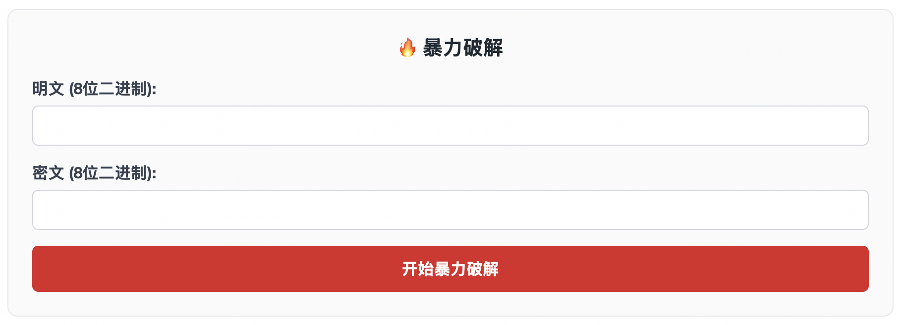
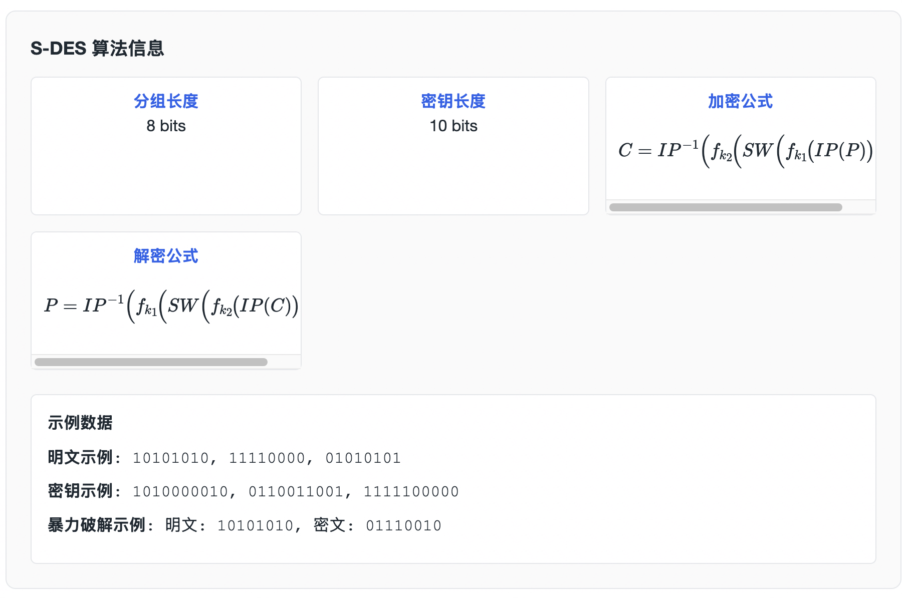

# S-DES 加解密 WEB-GO


## 项目简介

本实验使用 Go 语言配合 Gin 框架实现了简化数据加密标准（Simplified DES，简称 S-DES），并提供了一个直观的网页界面，方便对 8 位明文与 10 位密钥进行加密、解密实验。







## 快速开始

- **运行后端**：在项目根目录执行 `go run main.go`
- **访问前端**：浏览器打开 `http://localhost:8080`
- **API 接口**：
  - `POST /api/encrypt`：支持二进制和 ASCII 模式
    - 二进制：`{"plaintext":"8位二进制","key":"10位二进制"}`
    - ASCII：`{"plaintext_ascii":"ASCII字符串","key":"10位二进制"}`
  - `POST /api/decrypt`：支持二进制和 ASCII 模式
    - 二进制：`{"ciphertext":"8位二进制","key":"10位二进制"}`
    - ASCII：`{"ciphertext_ascii":"ASCII字符串","key":"10位二进制"}`
  - `POST /api/blasting`：暴力破解接口
    - 请求：`{"plaintext":"8位二进制","ciphertext":"8位二进制"}`
    - 响应：返回所有可能的密钥列表及执行时间


## 前端功能
- **双模式支持**：支持二进制（0/1）和 ASCII 字符输入模式
- **输入验证**：限制只能输入指定位数的二进制字符或 ASCII 文本
- **暴力破解**：提供专门的暴力破解界面，支持查找所有可能的密钥
- **结果展示**：暴力破解结果以列表形式展示，包含二进制和十进制格式


## S-DES 算法简单讲解
S-DES 是 DES 的教学版本，流程简洁易于理解。下面是加密与解密的大致步骤：

### 名词约定
- `IP` / `IP⁻¹`：初始置换及其逆置换。
- `P10` / `P8`：密钥置换。
- `EP`：右半部分扩展置换。
- `SPBox`：S 盒输出后的置换。
- `SW`：左右 4 位交换。
- `S1` / `S2`：两个 4×4 S 盒。

### 密钥扩展（生成两个 8 位子密钥）
1. 对 10 位主密钥做 `P10` 置换。
2. 分成左右各 5 位并分别左循环移位 1 位。
3. 合并后做 `P8`，得到子密钥 `K1`。
4. 在步骤 2 的结果基础上再次左移 1 位（累计 2 位）。
5. 合并后再做一次 `P8`，得到子密钥 `K2`。

### 加密流程概览
1. **初始置换**：对 8 位明文执行 `IP`，得到左右各 4 位。
2. **第一轮**：
   - 右半 4 位经过 `EP` 扩展为 8 位。
   - 与 `K1` 做异或。
   - 分成两组 4 位，分别查 `S1`、`S2`，得到各 2 位（二进制形式）。
   - 拼成 4 位后做 `SPBox`。
   - 与左半 4 位异或，结果作为新的左半。
3. **交换 SW**：左右 4 位对调。
4. **第二轮**：重复“第一轮”，但使用 `K2`，并对调前的右半与 `K2` 运算。
5. **逆初始置换**：将第二轮输出做 `IP⁻¹`，得到最终 8 位密文。

### 解密流程概览
解密与加密基本相同，只是子密钥使用顺序相反：
1. 明文换成密文输入，执行 `IP`。
2. 第一轮使用 `K2`，第二轮使用 `K1`。
3. 结束后执行 `IP⁻¹`，得到原始明文。


## 目录结构
```
SDES/
├── main.go                    # 主程序入口
├── go.mod                     # Go 模块依赖
├── go.sum                     # 依赖版本锁定
├── README.md                  # 项目说明文档
├── assets/                    # 文档图片
│   ├── image-20250926124445311.png
│   └── image-20250926124511827.png
├── controller/                # 控制器层
│   ├── encrypt.go            # 加密接口
│   ├── decrypt.go            # 解密接口
│   └── blasting.go           # 暴力破解接口
├── dto/                       # 数据传输对象
│   ├── request/              # 请求结构体
│   │   └── request.go
│   └── response/             # 响应结构体
│       └── response.go
├── router/                    # 路由配置
│   └── router.go
├── static/                    # 前端静态资源
│   ├── css/
│   │   └── style.css         # 页面样式
│   ├── js/
│   │   └── app.js            # 交互脚本
│   └── index.html            # 主页面
└── utils/                     # 工具包与算法实现
    ├── sdes.go               # S-DES 核心算法
    └── my_test.go            # S-DES 算法测试
```


## 后端流程图

### 1. 数据接收与解析
当前端发送ASCII码数据时，后端通过以下步骤接收：

```go
// 在 controller/encrypt.go 或 controller/decrypt.go 中
var req request.EncryptRequest  // 或 DecryptRequest
if err := c.ShouldBindJSON(&req); err != nil {
    // 处理JSON解析错误
}
```

前端发送的数据格式：
```json
{
    "plaintext_ascii": "Hello",  // ASCII字符串
    "key": "1010101010"          // 10位二进制密钥
}
```

### 2. 数据验证
后端对接收到的ASCII数据进行验证：

```go
// 检查是否提供了ASCII数据
if req.PlaintextASCII != nil {
    // 验证密钥格式
    if !utils.IsValidBinary(req.Key, 10) {
        // 返回错误：密钥必须是10位二进制
    }
    
    // 验证ASCII数据不为空
    if len(plaintextBytes) == 0 {
        // 返回错误：ASCII明文不能为空
    }
}
```

### 3. ASCII字符串转换为字节数组
使用 `ASCIIStringToBytes` 函数将ASCII字符串转换为字节数组：

```go
plaintextBytes, err := utils.ASCIIStringToBytes(*req.PlaintextASCII)
```

这个函数的核心逻辑：
```go
func ASCIIStringToBytes(s string) ([]byte, error) {
    bytes := make([]byte, 0, len(s))
    for _, r := range s {
        if r > 255 {  // 检查是否超出ASCII范围
            return nil, fmt.Errorf("字符 %q 超出 ASCII 范围", r)
        }
        bytes = append(bytes, byte(r))  // 转换为字节
    }
    return bytes, nil
}
```

### 4. 密钥处理
将10位二进制密钥字符串转换为位数组：

```go
keyBits := utils.StringToBits(req.Key, 10)
```

### 5. 加密/解密处理
对每个字节进行S-DES加密或解密：

**加密过程：**
```go
ciphertextBytes := utils.EncryptBytes(plaintextBytes, keyBits)
```

**解密过程：**
```go
plaintextBytes := utils.DecryptBytes(ciphertextBytes, keyBits)
```

`EncryptBytes` 函数的处理逻辑：
```go
func EncryptBytes(plaintext []byte, key []int) []byte {
    ciphertext := make([]byte, len(plaintext))
    for i, b := range plaintext {
        bits := ByteToBits(b)           // 将字节转换为8位比特数组
        encrypted := Encrypt(bits, key) // 使用S-DES算法加密
        ciphertext[i] = BitsToByte(encrypted) // 将加密后的比特转换回字节
    }
    return ciphertext
}
```

### 6. 字节数组转换回ASCII字符串
使用 `BytesToASCIIString` 函数将处理后的字节数组转换回ASCII字符串：

```go
result := utils.BytesToASCIIString(ciphertextBytes)
```

### 7. 返回响应
将处理结果封装成JSON响应返回给前端：

```go
c.JSON(http.StatusOK, response.EncryptResponse{
    CiphertextASCII: utils.BytesToASCIIString(ciphertextBytes),
    Success:         true,
})
```

## 关键处理步骤总结

1. **接收** → JSON解析ASCII字符串和密钥
2. **验证** → 检查数据格式和有效性
3. **转换** → ASCII字符串 → 字节数组
4. **处理** → 对每个字节进行S-DES加密/解密
5. **转换** → 字节数组 → ASCII字符串
6. **返回** → JSON响应给前端

这种设计允许处理任意长度的ASCII文本，通过逐字节处理的方式实现了对多字节数据的加密和解密功能。

## ASCII数据处理流程图

```
前端ASCII输入 → JSON请求 → 后端接收
     ↓
数据验证（密钥格式、ASCII范围）
     ↓
ASCII字符串 → 字节数组转换
     ↓
逐字节S-DES加密/解密
     ↓
字节数组 → ASCII字符串转换
     ↓
JSON响应 → 前端显示结果
```

## 参考资料
- 基于 2025 重庆大学大数据与软件学院信息安全导论
- Gin 官方文档：https://gin-gonic.com/