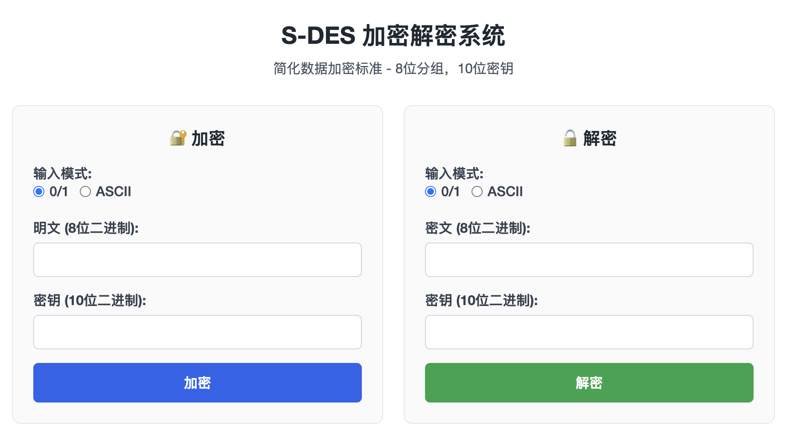
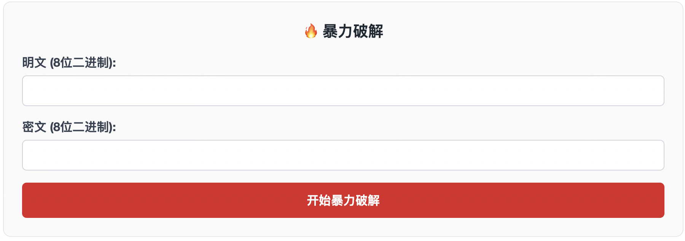
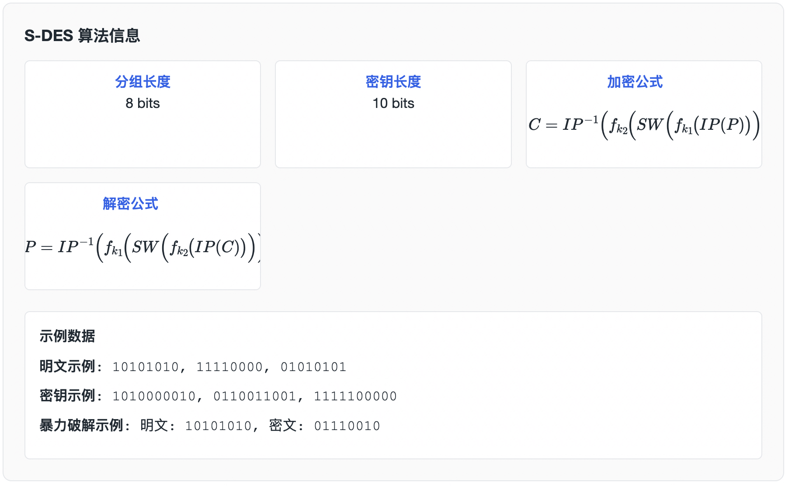
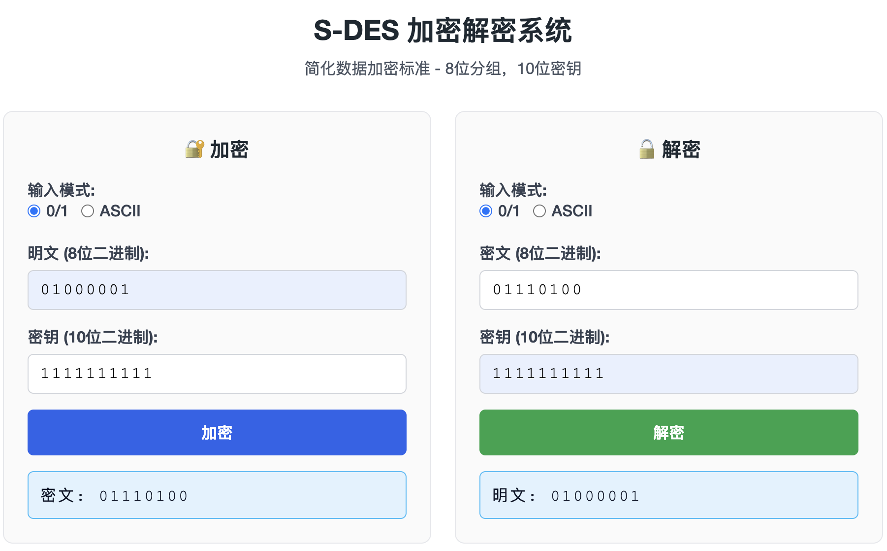
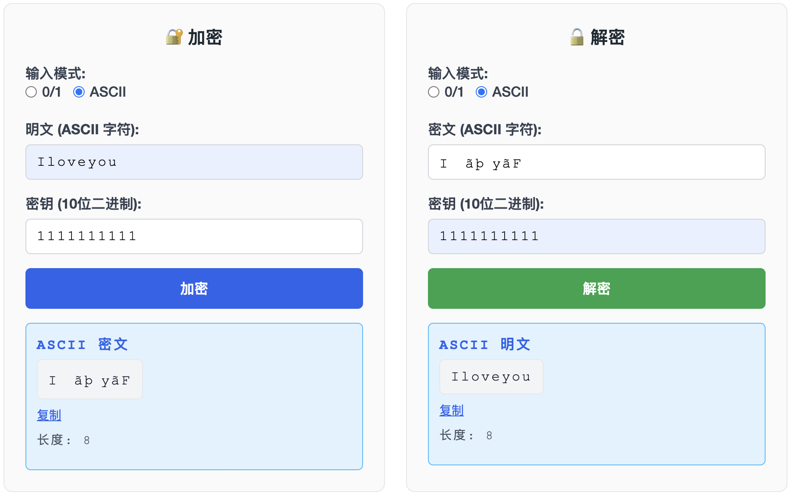
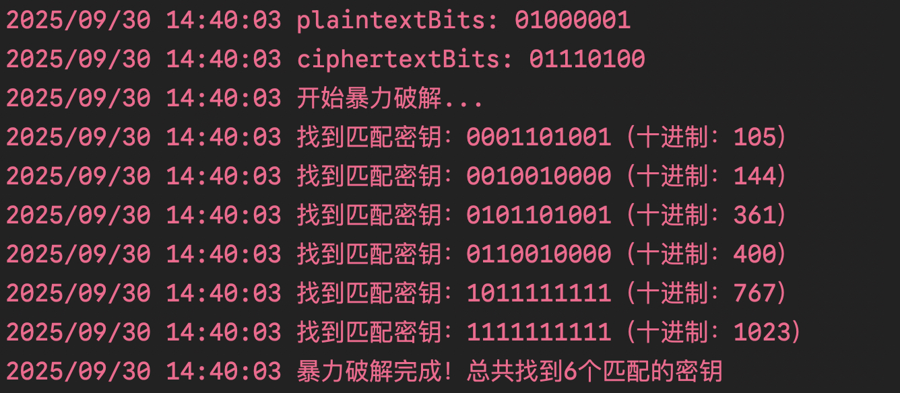
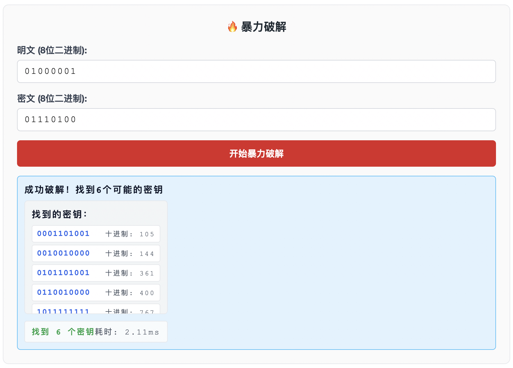
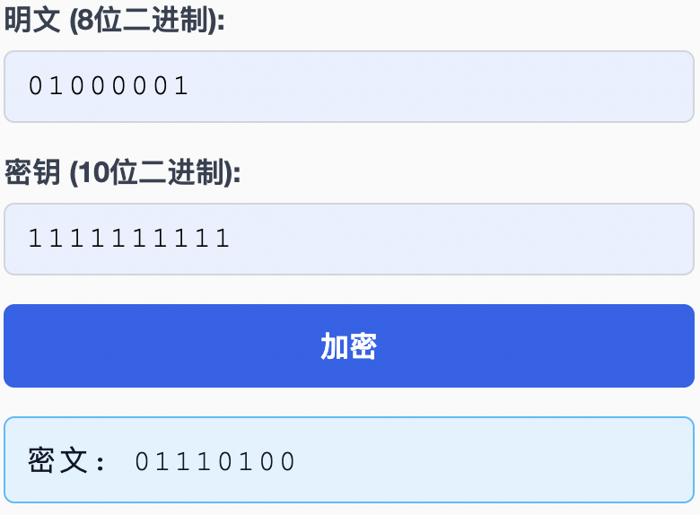
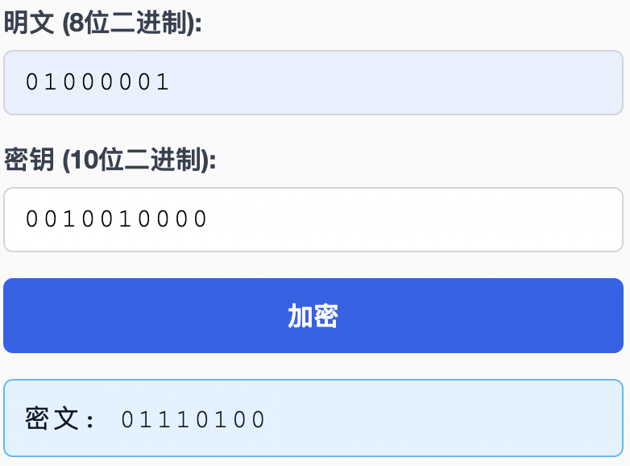

# S-DES WEB-GO 加解密实验一 

## 简介

本实验使用 Go 语言配合 Gin 框架实现了简化数据加密标准（Simplified DES，简称 S-DES），并提供了一个直观的网页界面，方便对 8 位明文与 10 位密钥进行加密、解密实验。








## 第一关

根据S-DES算法编写和调试程序，提供GUI解密支持用户交互。输入可以是8bit的数据和10bit的密钥，输出是8bit的密文。




## 第二关

考虑到是**算法标准**，所有人在编写程序的时候需要使用相同算法流程和转换单元(P-Box、S-Box等)，以保证算法和程序在异构的系统或平台上都可以正常运行。

设有A和B两组位同学(选择相同的密钥K)；则A、B组同学编写的程序对明文P进行加密得到相同的密文C；或者B组同学接收到A组程序加密的密文C，使用B组程序进行解密可得到与A相同的P。

参考别人的明文01000001，密钥1111111111，加密后的01110100在我们的程序上成功解密为01000001


## 第三关

考虑到向实用性扩展，加密算法的数据输入可以是ASII编码字符串(分组为1 Byte)，对应地输出也可以是ACII字符串(很可能是乱码)。

在明文为`Iloveyou`，密钥为`1111111111`的加密，解密结果如下。




## 第四关

假设你找到了使用相同密钥的明、密文对(一个或多个)，请尝试使用暴力破解的方法找到正确的密钥Key。在编写程序时，你也可以考虑使用多线程的方式提升破解的效率。请设定时间戳，用视频或动图展示你在多长时间内完成了暴力破解。

在明文为`01000001`，密文为`01110100`，我们暴力破解了1024个密钥，结果如下，时间消耗为2.11ms

后端显示：



Web显示：



## 第五关

根据第4关的结果，进一步分析，对于你随机选择的一个明密文对，是不是有不止一个密钥Key？进一步扩展，对应明文空间任意给定的明文分组$P_n$，是否会出现选择不同的密钥$K_{i}\ne K_{j}$加密得到相同密文$C_n$的情况？

- **问题一：** 随机选择的明密文对下，存在 6 个可能的密钥 Key。
- **问题二：** 对于任意明文分组 $P_n$，确实可能出现不同密钥 $K_{i}\ne K_{j}$ 加密得到同一密文 $C_n$ 的情况。

当密钥为`1111111111`，明文`01000001`加密为`01110100`



当密钥为`0010010000`，明文`01000001`同样的被加密为`01110100`



## 快速开始

- **启动后端**：在项目根目录运行 `go run main.go`
- **打开前端**：浏览器访问 `http://localhost:8080`
- **核心接口**：
  - `POST /api/encrypt`：`{"plaintext":"8位","key":"10位"}` 或 `{"plaintext_ascii":"文本","key":"10位"}`
  - `POST /api/decrypt`：`{"ciphertext":"8位","key":"10位"}` 或 `{"ciphertext_ascii":"文本","key":"10位"}`
  - `POST /api/blasting`：`{"plaintext":"8位","ciphertext":"8位"}` 返回所有可能密钥及耗时


## 前端功能
- **双模式支持**：支持二进制（0/1）和 ASCII 字符输入模式
- **输入验证**：限制只能输入指定位数的二进制字符或 ASCII 文本
- **暴力破解**：提供专门的暴力破解界面，支持查找所有可能的密钥
- **结果展示**：暴力破解结果以列表形式展示，包含二进制和十进制格式


## S-DES 算法简单讲解
S-DES 是 DES 的教学版本，流程简洁易于理解。下面是加密与解密的大致步骤：

### 名词约定
- `IP` / `IP⁻¹`：初始置换及其逆置换。
- `P10` / `P8`：密钥置换。
- `EP`：右半部分扩展置换。
- `SPBox`：S 盒输出后的置换。
- `SW`：左右 4 位交换。
- `S1` / `S2`：两个 4×4 S 盒。

### 密钥扩展（生成两个 8 位子密钥）
1. 对 10 位主密钥做 `P10` 置换。
2. 分成左右各 5 位并分别左循环移位 1 位。
3. 合并后做 `P8`，得到子密钥 `K1`。
4. 在步骤 2 的结果基础上再次左移 1 位（累计 2 位）。
5. 合并后再做一次 `P8`，得到子密钥 `K2`。

### 加密流程概览
1. **初始置换**：对 8 位明文执行 `IP`，得到左右各 4 位。
2. **第一轮**：
   - 右半 4 位经过 `EP` 扩展为 8 位。
   - 与 `K1` 做异或。
   - 分成两组 4 位，分别查 `S1`、`S2`，得到各 2 位（二进制形式）。
   - 拼成 4 位后做 `SPBox`。
   - 与左半 4 位异或，结果作为新的左半。
3. **交换 SW**：左右 4 位对调。
4. **第二轮**：重复“第一轮”，但使用 `K2`，并对调前的右半与 `K2` 运算。
5. **逆初始置换**：将第二轮输出做 `IP⁻¹`，得到最终 8 位密文。

### 解密流程概览
解密与加密基本相同，只是子密钥使用顺序相反：
1. 明文换成密文输入，执行 `IP`。
2. 第一轮使用 `K2`，第二轮使用 `K1`。
3. 结束后执行 `IP⁻¹`，得到原始明文。


## 目录结构
```
SDES/
├── main.go          # Gin 入口
├── controller/      # 加解密与暴力破解接口
├── dto/             # 请求/响应结构体
├── doc/             # 项目文档图片地址
├── router/          # 路由注册
├── utils/           # S-DES 算法与工具函数
└── static/          # 前端静态资源
```


## 后端流程图

1. **接收请求**：`controller` 绑定 JSON，识别二进制或 ASCII 字段。
2. **数据校验**：校验 10 位二进制密钥与输入不能为空；ASCII 超出范围直接报错。
3. **数据转换**：字符串转字节，调用 `utils.StringToBits` 生成密钥位数组。
4. **算法处理**：逐字节执行 `utils.Encrypt` / `utils.Decrypt`，得到新字节序列。
5. **结果封装**：字节转回二进制或 ASCII 字符串，返回 JSON 响应（含成功标记与耗时等信息）。

```
请求 JSON → 参数校验 → 字符串/位转换 → S-DES 处理 → JSON 响应
```

## 参考资料
- 基于 2025 重庆大学大数据与软件学院信息安全导论
- Gin 官方文档：https://gin-gonic.com/